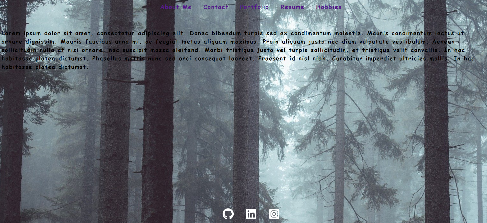

# React Portfolio  

**A redo of my professional portfolio using the React framework.**

## Acceptance Criteria

- GIVEN a single-page application portfolio for a web developer
- WHEN I load the portfolio
- THEN I am presented with a page containing a header, a section for content, and a footer
- WHEN I view the header
- THEN I am presented with the developer's name and navigation with titles corresponding to different sections of the portfolio
- WHEN I view the navigation titles
- THEN I am presented with the titles About Me, Portfolio, Contact, and Resume, and the title corresponding to the current section is highlighted
- WHEN I click on a navigation title
- THEN I am presented with the corresponding section below the navigation without the page reloading and that title is highlighted
- WHEN I load the portfolio the first time
- THEN the About Me title and section are selected by default
- WHEN I am presented with the About Me section
- THEN I see a recent photo of the developer and a short bio about them
- WHEN I am presented with the Portfolio section
- THEN I see titled images of six of the developer’s applications with links to both the deployed applications and the corresponding GitHub repository
- WHEN I am presented with the Contact section
- THEN I see a contact form with fields for a name, an email address, and a message
- WHEN I move my cursor out of one of the form fields without entering text
- THEN I receive a notification that this field is required
- WHEN I enter text into the email address field
- THEN I receive a notification if I have entered an invalid email address
- WHEN I am presented with the Resume section
- THEN I see a link to a downloadable resume and a list of the developer’s proficiencies
- WHEN I view the footer
- THEN I am presented with text or icon links to the developer’s GitHub and LinkedIn profiles, and their profile on a third platform (Stack Overflow, Twitter) 

## Grading Requirements

- [x] Application must use React to render content.
- [x] Application has a single Header component that appears on multiple pages, with a Navigation component within it that’s used to conditionally render About Me, Portfolio, Contact, and Resume sections.
- [ ] Application has a single Project component that’s used multiple times in the Portfolio section.

- [x] Application has a single Footer component that appears on multiple pages.

- [x] Application must be deployed to GitHub Pages.

- [x] Application deployed at live URL.

- [x] Application loads with no errors.

- [x] Application GitHub URL submitted.

- [x] GitHub repository contains application code.

- [ ] User experience is intuitive and easy to navigate.

- [ ] User interface style is clean and polished.

- [x] Application uses a color scheme other than the default Bootstrap color palette.

- [x] Repository has a unique name.

- [x] Repository follows best practices for file structure and naming conventions.

- [x] Repository follows best practices for class/id naming conventions, indentation, quality comments, etc.

- [x] Repository contains multiple descriptive commit messages.

- [x] Repository contains high-quality README file with description, screenshot, and link to deployed application.

## **Table of Contents**

 

* *[Installation](#installation)*
* *[Screenshots](#screenshots)*
* *[Usage Instructions](#usage-instructions)*
* *[Contributing](#contributing)*
* *[Technology](#technology)*
* *[Tests](#tests)*
* *[Questions](#questions)*
* *[License](#license)*

 

## **Installation**

 

After cloning/forking the applications use the command `npm i` or `npm install` to download the necessary dependencies.

 

## **Screenshots**

 

**Budget Tracker:**

 

## **Usage-instructions**

 

To test this application, or to run it locally use the command `npm start` to activate the react server.  It redering is successfull and there are no error messages in the terminal a new tab with the app will pop up.     

 

## **Contributing**

 

Please refer to the **[Contributor Covenant](https://www.contributor-covenant.org/)** for contribution guidelines.

 

## **Technology**

 

**This project was completed using:** 

  

- `React.js`
- `React-BootStrap`
- `React-Router`
- `Pixabay`

 

## **Tests**  

 

No test need to be run at this time. 

 

## **Questions**

 

For any questions, comments, or feedback please feel free to reach out:  
- **[Github](https://github.com/gintstir)** 
- **<gint.stirbys@gmail.com>**

 

## **License** 

 

Copyright © **Gintautas Stirbys**, **2021**.  All Rights Reserved.

This Project is licensed under the **[Apache~2.0](https://www.apache.org/licenses/LICENSE-2.0)** license.
